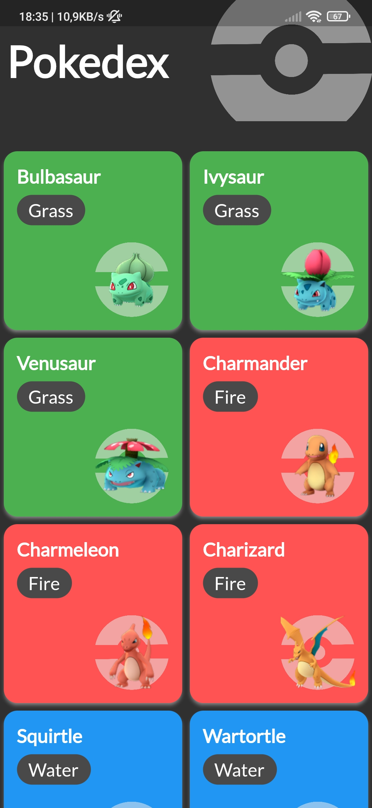

<h1 align="center">Pokedex mobile Application</h1>

<h3 align="center">
   :dart: About : 
  With this application,You can learn about Pokemon characters and views.
</h3>

Design of All Pages        
:-------------------------:

## :rocket: Technologies ##

The following tools were used in this project:

- [Flutter](https://flutter.dev/)
- [Dart](https://dart.dev/)
- [Vs Code](https://code.visualstudio.com/)
- [Android Studio](https://developer.android.com/studio?gclid=Cj0KCQiAyJOBBhDCARIsAJG2h5eL8TqlTcYWCGcBIPw1fvDCI8-HFaYlvzdfH8GUd_-j9kX9SbFTTJkaAo3MEALw_wcB&gclsrc=aw.ds)
